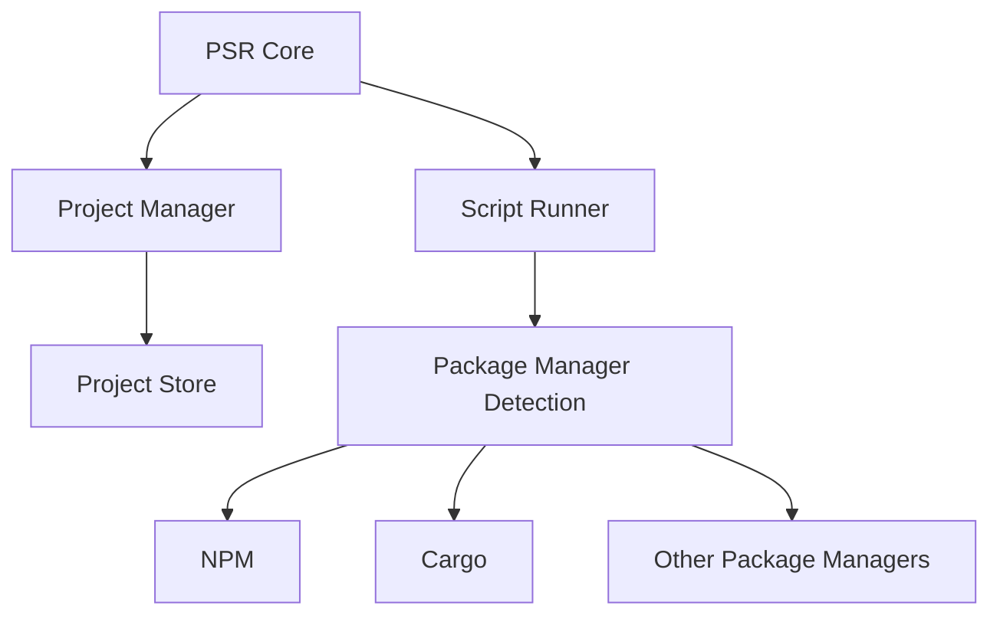

PSR (Package Script Runner) - Developer Notes
===========================================

Core Functionality
----------------
PSR is a TUI-based script runner that supports multiple package managers. The main features are:

1. Package Manager Support
   - NPM/Node.js projects (package.json)
   - Rust/Cargo projects (Cargo.toml)

   Detection is automatic based on project files.

2. Project Management
   - Add projects with aliases
   - List registered projects
   - Remove projects
   - Reference projects via -p flag

3. Script Execution
   - Direct script execution: psr <script-name>
   - Special 'run' command for custom scripts
   - Supports both successful and failing script scenarios

Error Handling
-------------
The system handles several error cases:
- Invalid project references
- Nonexistent scripts
- Unknown commands
- Directories without package managers
- Invalid script execution

CLI Interface
------------
Command structure:
psr [OPTIONS] [COMMAND] [ARGS]

Main commands:
- projects add <alias> <path>
- projects list
- projects remove <alias>
- --list : Show available scripts
- --version : Show version
- --help : Show help

Architecture Diagram
------------------

Testing Strategy
--------------
Integration tests cover:
1. Package manager detection
2. Comprehensive NPM functionality
3. Project management operations
4. Error handling scenarios
5. CLI options and commands

Each test category ensures isolated testing using temporary directories and cleanup.

Development Guidelines
-------------------
1. Always implement proper error handling with descriptive messages
2. Support both success and failure scenarios for script execution
3. Maintain clear separation between project management and script execution
4. Ensure proper cleanup of temporary resources
5. Follow semantic versioning for releases

Future Considerations
------------------
1. Support for additional package managers
2. Enhanced TUI features
3. Script execution history
4. Project favorites or tagging
5. Custom script aliases

Note: This is a living document and should be updated as the project evolves.
