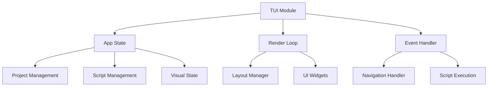

# TUI Module Documentation

## Overview
The TUI (Terminal User Interface) module provides an interactive terminal interface for PSR (Package Script Runner). It uses the `ratatui` library for rendering and `crossterm` for terminal manipulation.

## Core Components

### App Structure
The `App` struct manages the application state:
- Project management (current and available projects)
- Script selection and filtering
- Visual state (theme, emoji display)
- Selection states for projects and scripts

### Main Interface Elements
1. Projects List (top)
   - Shows all available projects
   - Highlights current directory project
   - Navigation: ←/→ keys

2. Scripts List (middle)
   - Groups scripts by category
   - Shows shortcuts, icons, and commands
   - Navigation: ↑/↓ keys

3. Details Panel (bottom)
   - Shows selected script details:
     - Name and icon
     - Type and category
     - Command
     - Description

4. Help Footer
   - Displays navigation hints

## Key Features

### Navigation
- Script Selection: ↑/↓ or j/k keys
- Project Switching: ←/→ keys
- Script Execution: Enter key
- Quick Access: Shortcut keys
- Exit: q or Esc

### Visual Elements
- Color-coded script types
- Optional emoji icons
- Clear separation between script groups
- Highlighted selections

### Error Handling
- Displays error splash screen for failed scripts
- Shows exit codes
- Graceful terminal state management

## Architecture Diagram


## Terminal Management
- Handles raw mode
- Manages alternate screen
- Ensures proper cleanup on exit
- Graceful error handling

## Usage Example
```rust
let settings = Settings::default();
let project = Project::new("my-project", "path/to/project");
run_app(&project, &settings)?;
```

## Error Handling
The module implements comprehensive error handling:
- Terminal state recovery
- Script execution errors
- Project loading failures
- User input validation

## Best Practices
1. Always use the terminal preparation/restoration functions
2. Handle terminal cleanup with `scopeguard`
3. Implement proper error handling for script execution
4. Maintain consistent visual feedback
